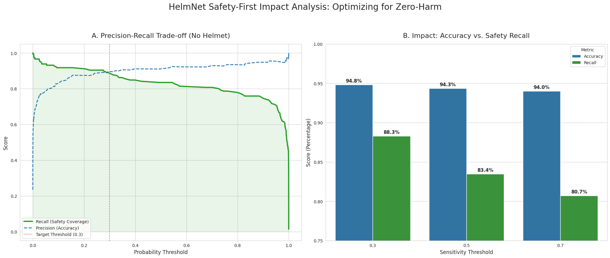
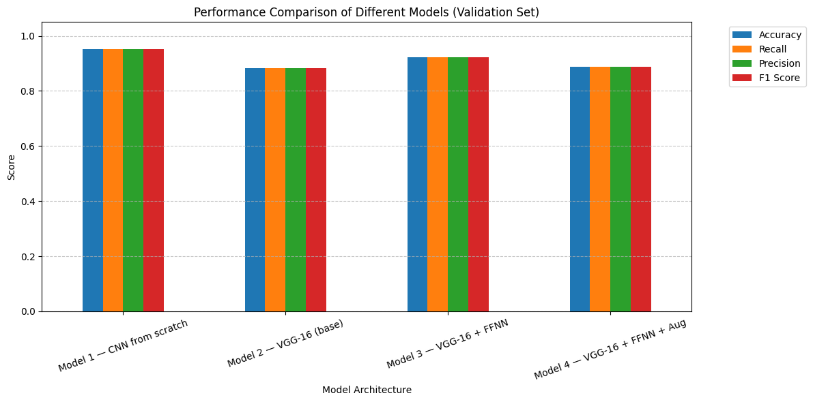
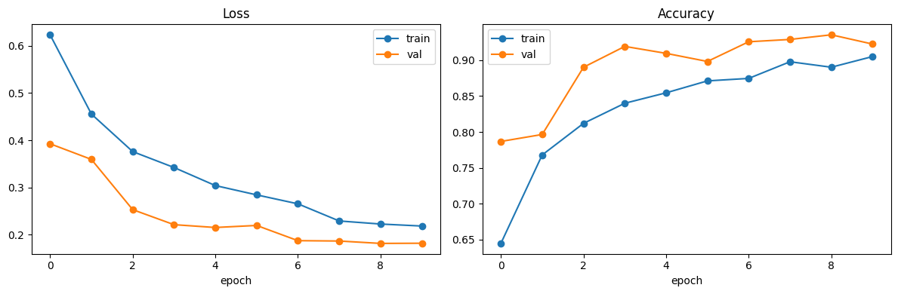
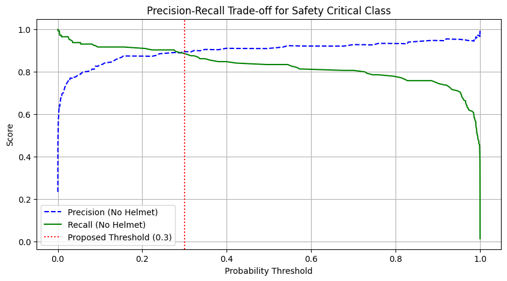
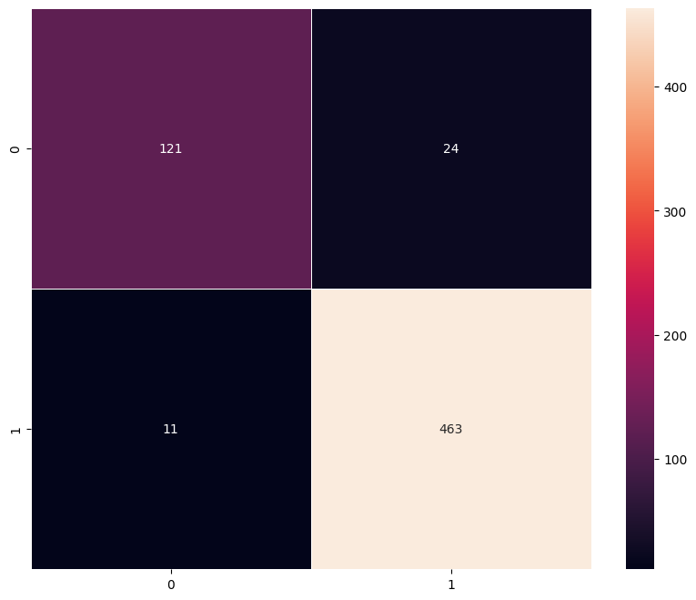
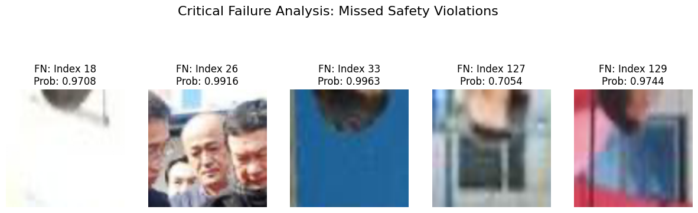

# HelmNet — Safety-First Helmet Detection

**Binary computer-vision classifier that flags workers without safety helmets on construction and industrial sites — tuned for Zero-Harm deployment.**

Transfer-learned VGG-16 + custom head, trained in TensorFlow / Keras, exported to `.keras` and `.tflite` for cloud and edge inference. The notebook ships with an explicit **safety-first threshold analysis** — a production-minded design choice that trades a small amount of precision for a measurable gain in violation recall.



---

## Why this project is framed the way it is

Most helmet-detection notebooks stop at "94% accuracy, ship it." That's the wrong stopping point.

In an industrial safety setting, a **false negative** (a worker without a helmet goes undetected) is a potential injury or fatality. A **false positive** (a compliant worker gets flagged for review) is a few seconds of a supervisor's time. Those two errors are not the same and they should not be weighted the same.

This project treats that asymmetry as a first-class design decision. The model is trained to high accuracy, but the final deliverable is not a model checkpoint — it's a **decision logic** with a tuned operating threshold, a tiered action policy, and a deployment format that can run on-site.

| Threshold | Accuracy | Violation Recall | What it means in the field |
|:---------:|:--------:|:----------------:|:---------------------------|
| 0.5 (default) | 94.3% | 83.4% | Roughly **1 in 6 violations missed** |
| **0.3 (safety-first)** | **94.8%** | **88.3%** | Missed violations reduced by ~30% at effectively zero accuracy cost |

The trade-off happens to land in a sweet spot where lowering the threshold to 0.3 **improves both** accuracy and recall on the safety-critical class, because the precision–recall curve is nearly flat in that region. That's not always the case — but verifying it empirically is the whole point of doing the analysis.

---

## Results at a glance

**Dataset:** 4,125 industrial-scene images — 3,161 *With Helmet*, 964 *Without Helmet* (3.3 : 1 class imbalance).

**Final architecture:** VGG-16 (ImageNet-pretrained, frozen base) + custom feed-forward head + real-time data augmentation.

**Headline metrics** (test set, safety threshold = 0.3):
- Accuracy: **94.8%**
- Recall on *Without Helmet* class (safety-critical): **88.3%**
- Macro F1: **~0.94**
- Exported formats: `.keras` (cloud inference) and `.tflite` (edge inference, verified via `tf.lite.Interpreter`)

### Architecture ablation



Four architectures were evaluated on the same train/val split. The VGG-16 + FFNN variant (Model 3) was selected for final evaluation because it offered the best balance of validation performance and training stability. Augmentation (Model 4) was retained for the production training run to improve robustness to lighting and viewpoint variation.

### Training dynamics



Loss and accuracy curves for the final model. Validation tracks training closely across all ten epochs — no material overfitting, which is consistent with the use of a frozen VGG-16 backbone and image augmentation.

### Threshold analysis



Precision and recall for the *No Helmet* (safety-critical) class across the full threshold sweep. The red dashed line marks the selected operating point at 0.3 — the inflection where recall is still climbing steeply but precision has plateaued.

### Confusion matrix (default threshold, for reference)



Rows = true class, columns = predicted. At the default 0.5 threshold, 24 of 145 *Without Helmet* images were misclassified as compliant — the gap the 0.3 threshold is designed to close.

### Where the model still fails



Qualitative review of the highest-confidence missed violations. Most failures are extreme crops, partial occlusions, or cases where the head is not clearly visible — classes of error that a real deployment would address by **chaining a person/face detector in front of HelmNet** rather than by retraining the classifier.

---

## Deployment model

HelmNet is designed as the **classification stage of a two-stage pipeline**, not a standalone detector:

```
Camera frame → Person / face detector → Crop → HelmNet → Tiered action policy
```

The tiered action policy converts a single probability into an operational decision:

| P(No Helmet) | Classification | Action |
|:------------:|:---------------|:-------|
| > 0.70 | High Risk | Immediate audio alert + supervisor notification |
| 0.30 – 0.70 | Moderate Risk | Secondary automated verification or manual CCTV review |
| < 0.30 | Compliant | No action; log entry for compliance audit |

This is the layer that turns "a model with 94.8% accuracy" into "a system a site manager can actually defend to a regulator."

---

## Repository contents

```
helmnet/
├── README.md                         # You are here
├── LICENSE                           # MIT
├── requirements.txt                  # Pinned versions
├── .gitignore
├── notebooks/
│   └── HelmNet_Final.ipynb           # End-to-end: load → train → evaluate → export
├── reports/
│   └── HelmNet_Final_Report.html     # Rendered report with all outputs
├── assets/                           # Figures used in this README
└── data/
    └── README.md                     # How to obtain the dataset (not committed)
```

---

## Reproducibility

**Environment.** Python 3.10+, TensorFlow 2.19, scikit-learn 1.6.1. Full pins in `requirements.txt`.

**Seeds.** Python / NumPy / TensorFlow seeds are all set to `812`, and `tf.config.experimental.enable_op_determinism()` is enabled before training. On the same hardware with the same data split, results are reproducible to within floating-point tolerance.

**Hardware.** Developed and trained on a single NVIDIA GPU in Google Colab. CPU-only execution works but training will be slow.

**Data.** The 4,125-image dataset is not redistributed here — see `data/README.md` for how to obtain it. The expected layout is `data/images.npy` and `data/labels.csv` at the project root.

### Running the notebook

```bash
git clone https://github.com/JeremyGracey-AI/helmnet.git
cd helmnet
python -m venv .venv && source .venv/bin/activate
pip install -r requirements.txt
jupyter lab notebooks/HelmNet_Final.ipynb
```

---

## Tech stack

**Modeling:** TensorFlow 2.19 · Keras · VGG-16 transfer learning · scikit-learn (metrics, splits)
**Visualization:** Matplotlib · Seaborn · OpenCV
**Deployment artifacts:** `.keras` (cloud) · `.tflite` (edge, validated with `tf.lite.Interpreter`)
**Environment:** Jupyter / Google Colab · deterministic seeding

---

## Author

**Jeremy Gracey** — Applied AI Engineer · Clinical Domain Expert · Technical Founder
Building clinical-grade AI systems under **PREVERA** (GUARDIAN+AI fall detection, MH GUARDIAN+AI mental-health safety).

- Website: [jeremygracey.ai](https://jeremygracey.ai)
- LinkedIn: [linkedin.com/in/jeremygracey-AI](https://linkedin.com/in/jeremygracey-AI)
- GitHub: [github.com/JeremyGracey-AI](https://github.com/JeremyGracey-AI)
- Hugging Face: [huggingface.co/jeremygracey-ai](https://huggingface.co/jeremygracey-ai)

---

## License

MIT — see [`LICENSE`](LICENSE).
